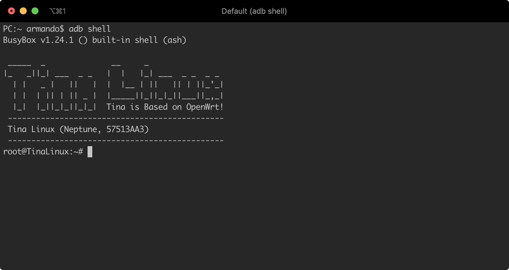

# ADB shell without password

For the  **Cecotec Conga models 3290, 3390, 3490, 3590, 3690 & 3790** it's
possible to change the original adb shell login script[^1] to avoid any password request at all.

## Requirements

* a Conga 3x90 model (of course!)
* a USB to microUSB cable
* a computer with ADB installed ([guide](https://www.xda-developers.com/install-adb-windows-macos-linux/))

## Procedure

### 1. Create a new ADB shell script

Edit a new **adb_shell** script file with the following contents:

```bash
#!/bin/sh
export ENV='/etc/adb_profile'
exec /bin/sh "$@"
```

and change its attributes to be <code>rwxrw-rw-</code>:

```bash
PC:~ armando$ chmod 755 adb_shell
```

### 2. Change the old shell by the new one
Connect your Conga to your PC using the micro-usb conector in the front (the one bellow the rubber-tap):


and execute the following commands:

```bash
PC:~ armando$ adb pull /bin/adb_shell adb_shell.original # create a backup of the original file
PC:~ armando$ adb push -a adb_shell /bin/adb_shell
```

### 3. Check your passwordless access
If everything was ok, you can now execute the following command

```bash
PC:~ armando$ adb shell
```

and you'll get a root-console session directly (without typing any password)



## Notes:
[^1]: Original adb shell script <code>/bin/adb_shell</code>:

	```bash
	#!/bin/sh
	export ENV='/etc/adb_profile'
	if [ $1 = '-' ];then
		/bin/login
	elif [ $1 = '-c' ];then
		/bin/login -c "$2"
	else
		/bin/login
	fi

	```
